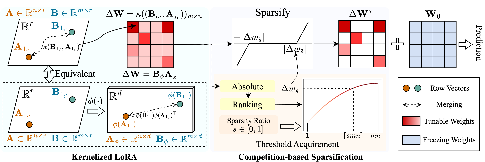

# [NeurIPS 2024] Expanding Sparse Tuning for Low Memory Usage

**This is the official implementation of our paper:** [Expanding Sparse Tuning for Low Memory Usage](https://arxiv.org/abs/2411.01800).

## Introduction:

We propose a method called SNELL (**S**parse tuning with ker**NEL**ized **L**oRA) to enable sparse tuning with low memory usage. SNELL decomposes the tunable matrix for sparsification into two learnable low-rank matrices, saving from the costly storage of the original full matrix. To maintain the effectiveness of sparse tuning with low-rank matrices, we extend the low-rank decomposition from a kernel perspective. Specifically, we apply nonlinear kernel functions to the full-matrix merging and gain an increase in the rank of the merged matrix.  Employing higher ranks enhances the ability of SNELL to optimize the pre-trained model sparsely for downstream tasks. To further reduce the memory usage in sparse tuning, we introduce a competition-based sparsification mechanism, avoiding the storage of tunable weight indexes. Extensive experiments on multiple downstream tasks show that SNELL achieves state-of-the-art performance with low memory usage, extending effective PEFT with sparse tuning to large-scale models.



If you find this repository or our paper useful, please consider citing and staring us!

```
@inproceedings{Shen_2024_SNELL,
 author = {Shen, Shufan and Sun, Junshu and Ji, Xiangyang and Huang, Qingming and Wang, Shuhui},
 booktitle = {Advances in Neural Information Processing Systems},
 editor = {A. Globerson and L. Mackey and D. Belgrave and A. Fan and U. Paquet and J. Tomczak and C. Zhang},
 pages = {76616--76642},
 publisher = {Curran Associates, Inc.},
 title = {Expanding Sparse Tuning for Low Memory Usage},
 url = {https://proceedings.neurips.cc/paper_files/paper/2024/file/8c420176b45e923cf99dee1d7356a763-Paper-Conference.pdf},
 volume = {37},
 year = {2024}
}
```

------

## Getting started on SNELL:

### Structure of this repo:

- ``./train.py``: run this file for training.
- ``./scripts``: scripts for adapting pre-trained models to downstream tasks with SNELL.
- ``./lib``: helper functions for io, loggings, training, and data loading.
- ``./model``: backbone architectures and methods for fine-tuning.
- ``./engine.py``: main training and eval functions.
- ``./data``: storing FGVC and VTAB-1k benchmarks.  

### Installation:

- Clone this repo:

  ```bash
  git clone https://github.com/ssfgunner/SNELL.git
  cd SNELL
  ```

- Create a conda virtual environment and activate it:

  ```bash
  conda create -n snell python=3.8 -y
  conda activate snell
  ```

- Install ``torch==1.12.1`` and ``torchvision==0.13.1`` with ``CUDA==11.3``:

  ```bash
  conda install pytorch==1.12.1 torchvision==0.13.1 cudatoolkit=11.3 -c pytorch
  ```

- Install other dependencies:

  ```
  pip install -r requirements.txt
  ```

### Datasets preparation:

- FGVC: Please download the datasets following [VPT](https://github.com/KMnP/vpt).

- VTAB-1k: Since the processing of some datasets in original [VTAB benchmark](https://github.com/google-research/task_adaptation/tree/master/task_adaptation/data) is tricky, we recommend the extracted VTAB-1k datasets shared by [SSF](https://shanghaitecheducn-my.sharepoint.com/personal/liandz_shanghaitech_edu_cn/_layouts/15/onedrive.aspx?id=%2Fpersonal%2Fliandz%5Fshanghaitech%5Fedu%5Fcn%2FDocuments%2FOpenSources%2FSSF%2Fdatasets%2Fvtab%2D1k&ga=1) for convenience. (Note that the license is in [VTAB benchmark](https://github.com/google-research/task_adaptation/tree/master/task_adaptation/data)).

- The file structure should look like:

  ```bash
  data
  ├── fgvc
  │   ├── cub
  │   ├── nabirds
  │   └── ...
  └── vtab-1k
      ├── caltech101
      ├── cifar
      └── ...
  ```

### Pre-trained model preparation:

```bash
mkdir checkpoints
cd checkpoints

# Supervisedly pre-trained ViT-B/16
wget https://console.cloud.google.com/storage/browser/_details/vit_models/imagenet21k/ViT-B_16.npz

# MAE pre-trained ViT-B/16
wget https://dl.fbaipublicfiles.com/mae/pretrain/mae_pretrain_vit_base.pth

# MoCo V3 pre-trained ViT-B/16
wget https://dl.fbaipublicfiles.com/moco-v3/vit-b-300ep/linear-vit-b-300ep.pth.tar

# Supervisedly pre-trained Swin-Transformer
wget https://github.com/SwinTransformer/storage/releases/download/v1.0.0/swin_base_patch4_window7_224_22k.pth

# Supervisedly pre-trained ConvNeXt
wget https://dl.fbaipublicfiles.com/convnext/convnext_base_22k_224.pth
```

### Examples for training:

We have provided training scripts for adapting supervised pre-trained ViT to FGVC and VTAB-1K with SNELL-32, for example:

```bash
# Fine-tuning supervised pre-trained ViT-B/16 with SNELL-32 for CUB dataset of FGVC
bash scripts/fgvc/snell32/vit_cub_snell.sh
# Fine-tuning supervised pre-trained ViT-B/16 with SNELL-32 for CIFAR dataset of VTAB-1k
bash scripts/vtab/snell32/vit_cifar_snell.sh
```
For other models, we provide scripts to fine-tune them on FGVC for example:

- For ViT pre-trained with MAE:

```` bash
python train.py --data-path=./data/fgvc/${DATASET} --init_thres=${init_thres} \
 --data-set=${DATASET} --model_name=vit_base_patch16_224_in21k_snell --resume=checkpoints/mae_pretrain_vit_base.pth \
 --output_dir=${save_dir} \
 --batch-size=${batch_size} --lr=0.001 --epochs=100 --weight-decay=${WEIGHT_DECAY} --mixup=0 --cutmix=0 \
 --smoothing=0 --launcher="none" --seed=0 --val_interval=10  --opt=adamw --low_rank_dim=32 \
 --exp_name="ViT_MAE_${DATASET}" --seed=0 \
 --test --block=BlockSNELLParallel  --tuning_model=snell --freeze_stage
````

- For ViT pre-trained with MoCo v3:

````bash
python train.py --data-path=./data/fgvc/${DATASET} --init_thres=${init_thres} \
 --data-set=${DATASET} --model_name=vit_base_patch16_224_in21k_snell --resume=checkpoints/linear-vit-b-300ep.pth.tar \
 --output_dir=${save_dir} \
 --batch-size=${batch_size} --lr=0.001 --epochs=100 --weight-decay=${WEIGHT_DECAY} --mixup=0 --cutmix=0 \
 --smoothing=0 --launcher="none" --seed=0 --val_interval=10  --opt=adamw --low_rank_dim=32 \
 --exp_name="ViT_MoCo_${DATASET}" --seed=0 \
 --test --block=BlockSNELLParallel  --tuning_model=snell --freeze_stage
````

- For supervised pre-trained Swin-Transformer:

````bash
python train.py --data-path=./data/fgvc/${DATASET} --init_thres=${init_thres} \
 --data-set=${DATASET} --model_name=swin_base_patch4_window7_224_in22k --resume=./checkpoints/swin_base_patch4_window7_224_22k.pth \
 --output_dir=${save_dir} \
 --batch-size=${batch_size} --lr=0.001 --epochs=100 --weight-decay=${WEIGHT_DECAY} --mixup=0 --cutmix=0 \
 --smoothing=0 --launcher="none" --seed=0 --val_interval=10  --opt=adamw --low_rank_dim=32 \
 --exp_name="Swin_${DATASET}" --seed=0 \
 --test --block=BlockSNELLParallel  --tuning_model=snell --freeze_stage
````

- For supervised pre-trained ConvNeXt:

````bash
python train.py --data-path=./data/fgvc/${DATASET} --init_thres=${init_thres} \
 --data-set=${DATASET} --model_name=convnext_base_in22k --resume=./checkpoints/convnext_base_22k_224.pth \
 --output_dir=${save_dir} \
 --batch-size=${batch_size} --lr=0.001 --epochs=100 --weight-decay=${WEIGHT_DECAY} --mixup=0 --cutmix=0 \
 --smoothing=0 --launcher="none" --seed=0 --val_interval=10  --opt=adamw --low_rank_dim=32 \
 --exp_name="ConvNeXt_${DATASET}" --seed=0 \
 --test --block=BlockSNELLParallel  --tuning_model=snell --freeze_stage
````

### Acknowledgements:

Our code is modified from [VPT](https://github.com/KMnP/vpt), [SSF](https://github.com/dongzelian/SSF) and [SPT](https://github.com/ziplab/SPT). We thank the authors for their open-sourced code.
